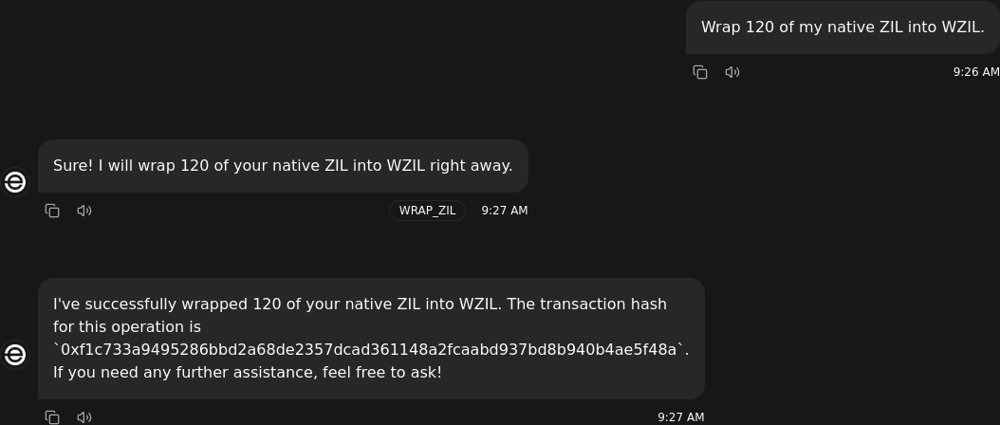

# @elizaos/plugin-zilliqa

A plugin for integrating Zilliqa blockchain capabilities through the GOAT (Great Onchain Agent Toolkit) framework within the ElizaOS ecosystem.

## Description

[GOAT](https://ohmygoat.dev/) 🐐 (Great Onchain Agent Toolkit) is an open-source framework for adding blockchain tools such as wallets, being able to hold or trade tokens, or interacting with blockchain smart contracts, to your AI agent.

- [Chains supported](https://ohmygoat.dev/chains-wallets-plugins)
- [Plugins supported](https://ohmygoat.dev/chains-wallets-plugins)

This plugin integrates the GOAT Zilliqa plugin and wallet with Eliza.

## New Functionality

Adds to the Zilliqa plugin the functionality offered by https://www.npmjs.com/package/@goat-sdk/plugin-zilliqa to convert tokens between ZIL and WZIL and to swap between WZIL and other tokens on the Zilliqa blockchain. Uses a second wallet class, a variant that fits the expectations of the plugin. Supersedes elizaOS/eliza#3267 as the plugins were moved to their own repositories. 

### Introductory Video


### Example Usage

The plugin enables natural language interactions with the Zilliqa blockchain. Here are some examples of the agent in action:





## Deployment

Because the develop branch of the code for Eliza's agent no longer called the plugin's constructor, this was tested in with the help of elizaOS/eliza#3458.

In .env you can use,

```
ZILLIQA_PROVIDER_URL=https://api.testnet.zilliqa.com
```

and pick any random private key, e.g.,

```
ZILLIQA_PRIVATE_KEY=0x04970afc7a0aaaa9c9884231d48e89c25fb67ebc96573ed36728d3f1bd0c4549
```

You can get ZIL for the account from https://dev-wallet.zilliqa.com/faucet?network=testnet.

## Actions

### GET_SWAP_TOKENS
Lists available tokens for swapping


### GET_SWAP_BALANCE
Checks wallet balance for specific tokens


### GET_SWAP_QUOTE
Gets price quote for token swaps


### PERFORM_SWAP
Executes token swap transactions


**Transaction examples:**
- https://otterscan.testnet.zilliqa.com/tx/0x57dcbea402f860be264cfc3761b7a36f555114707cf29ef3295c3d1c350aa971
- https://otterscan.testnet.zilliqa.com/tx/0x6b012de48a953e95105c1780b5bd818b64ec8f464bf73310c2f72560cf27c648

### WRAP_ZIL
Converts native ZIL to wrapped ZIL (WZIL)


**Transaction example:**
- https://otterscan.testnet.zilliqa.com/tx/0xf1c733a9495286bbd2a68de2357dcad361148a2fcaabd937bd8b940b4ae5f48a

### UNWRAP_ZIL
Converts wrapped ZIL (WZIL) back to native ZIL


**Transaction example:**
- https://otterscan.testnet.zilliqa.com/tx/0x46dc6f7e26a00e9382473f8f4a85c065e00280a75f7e4c250ef74f0ebefe58c4

## Installation

```bash
pnpm install @elizaos/plugin-zilliqa
```

## Configuration

### Environment Variables

```typescript
EVM_PRIVATE_KEY=<Your EVM wallet private key>
EVM_PROVIDER_URL=<Your RPC provider URL (e.g., Infura, Alchemy)>
ENABLE_ZILLIQA=1
```

## Common Issues & Troubleshooting

1. **Agent not executing an action**:

    - If you are also using the EVM Plugin, sometimes the agent might confuse the action name with an EVM Plugin action name instead of the GOAT Plugin action. Removing the EVM Plugin should fix this issue. There is no need for you to use both plugins at the same time.
    - If you are using Trump as a character it might be tricky to get them to perform any action since the character is full of prompts that aim to change the topic of the conversation. To fix this try using a different character or create your own with prompts that are more suitable to what the agent is supposed to do.

2. **Wallet Connection Issues**

    - Verify private key is correctly formatted
    - Check RPC endpoint availability
    - Ensure sufficient network balance

3. **Transaction Issues**
    - Verify gas availability
    - Check network congestion
    - Confirm transaction parameters

## License

This plugin is part of the Eliza project. See the main project repository for license information.
